# School_District_Analysis

## Overview of the school district analysis
This analysis examines student funding and student standardized test scores for a variety of high schools to determine trends in school performance. Insights generated will  help the school board determine whether to modify the school budgeting and how to prioritize when making such decisions. 

## Results
### District Summary
- The only differences seen in the district summary were a very slight decrease in the Average Math Score, % Passing Math, and % Overall Passing columns (as seen below). However, this differences could be accounted for by rounding the numbers as the difference is less than 1%.
    - 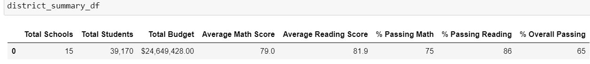
    - 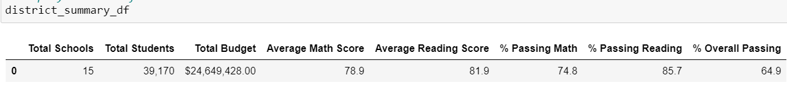

### School Summary
- The only data in the school summary which was affected was in the row for Thomas High School. As seen in the images below, the % Passing Math, % Passing Reading, and % Overall Passing dropped very slighlty for Thomas High School but remained the same for the high schools listed above and below. Percentages dropped by less than 1% after removing all ninth grade data. 
    - 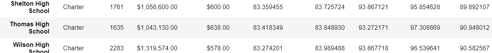
    - 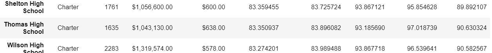

### Relative Performance
- Replacing the ninth graders' math and reading scores did not affect Thomas High School's performance relative to the other schools as it remained as second in the top five schools. 
    - 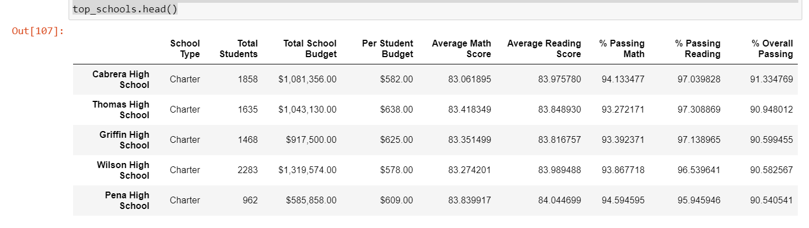
    - 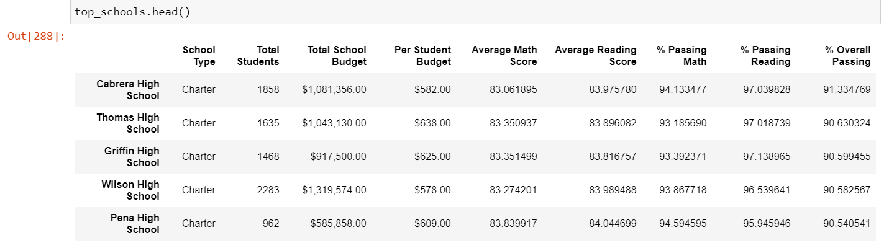

- Replacing ninth-grade scores had the following results:
    ### Math and Reading Scores
    - Math and reading scores by grade were not affected for the most part. The only big difference is seen in the "9th" column for Thomas High School which now has "NaN" as those score are now not being used. An example of this can be seen in the image below.
        - 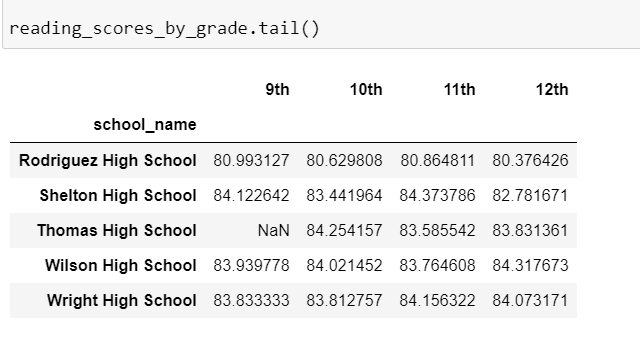
    
    ### Scores by School Size
    - Scores by school size were not affected (as seen below).
        - 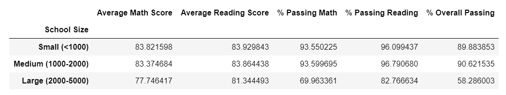
        - 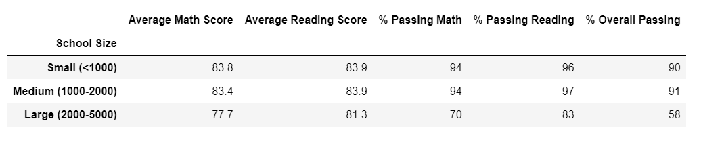
    
    ### Scores by School Type
    - Scores by school type were also not affected (as seen below).
        - 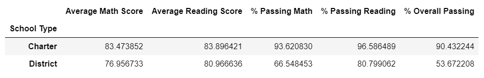
        - 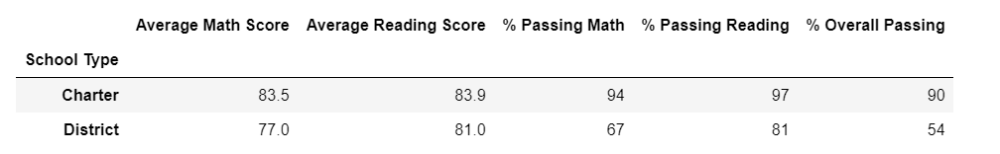

## Summary
Even after reading and math scores for the ninth grade at Thomas High School were replaced by NaNs, many of the scores and rankings remained relatively the same. However, it should be noted that one slight change did occur in the percentage of students who passed math for Thomas High School in the school summary. This means that the average ninth grade score raised the overall percentage of math scores for the whole school by less than 1%. A similar change can be seen in the percentage of students who passed reading in Thomas High School, with the percentage decreasing by less than 1% after removing all ninth grade scores. These two changes led to a similar slight decrease in the overall percentage of students passing math and reading for Thomas High School. In addition, the district summary depicts a very slight decrease for the average math score for all students, the percentage of students who passed math, and the overall percentage of students who passed both math and reading. This may be due to the Thomas High School ninth grade students receiving higher than avergage math scores. However, all changes are not drastic and result in the same analysis if all numbers were to be rounded. Lastly, all scores pertaining to math and reading scores for ninth grade students in Thomas High School have been replaced with "NaN" for all DataFrames, including the math and reading scores by grade.
